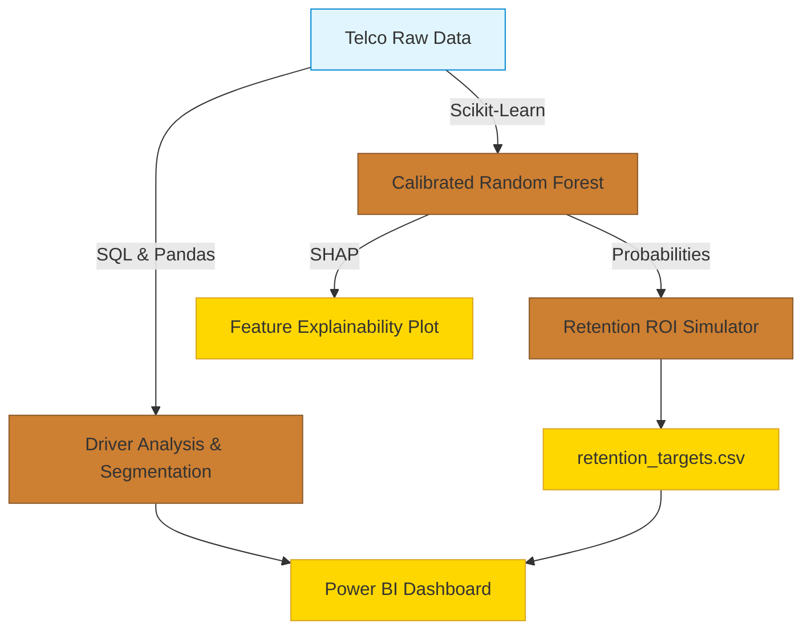
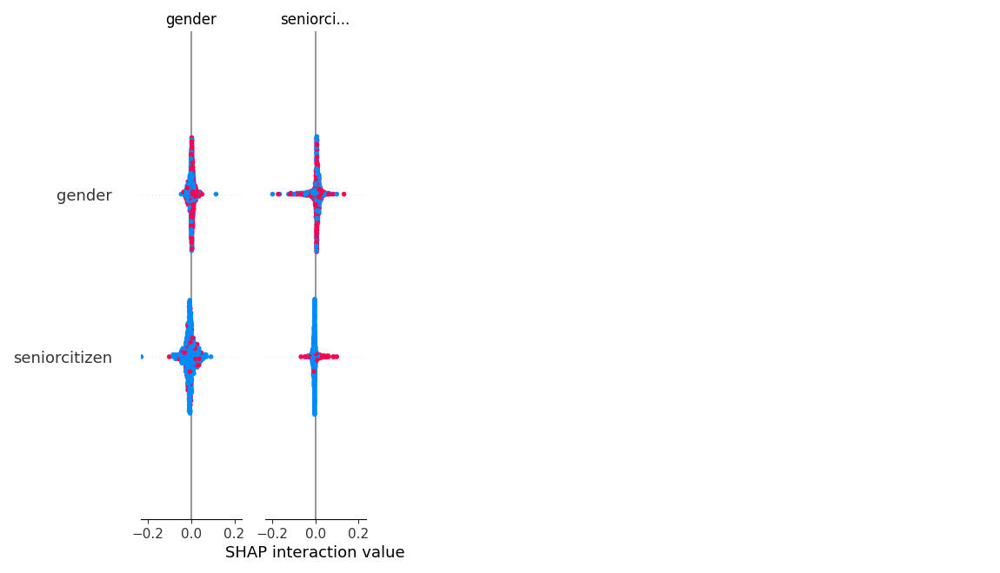

# Customer Churn & Retention Analysis

[](#architecture)
[](#machine-learning-engine)
[](LICENSE)

**One-line pitch:** A full-stack business analytics project that translates raw telecom customer data into a calibrated predictive model, surfaces the drivers of churn using advanced SQL and SHAP, and calculates the exact ROI of a targeted retention campaign.

---

## 📊 Executive Summary

Customer churn is the silent killer of subscription businesses. This project goes beyond simply training a machine learning model; it answers the **"so what?"** for business stakeholders. By combining predictive modeling with financial ROI simulation, we identify exactly who is going to churn, *why* they are leaving, and exactly how much money we can save by intervening.

### Key Quantitative Findings

> **1. The Retention ROI Pipeline**
> Using a calibrated Random Forest model, we scored all 7,043 active customers and calculated the Expected Value of Action (EVA) assuming a $50 retention offer and a 30% intervention success rate. We identified **4,074 high-risk customers** where an intervention yields a positive ROI, resulting in **$744,395 in projected net savings** over a 24-month horizon.

> **2. The Contract Trap (SQL & SHAP Drivers)**
> Both our advanced SQL cross-tabs and our SHAP Machine Learning explainers independently isolated **Contract Type** and **Tenure** as the massive, overwhelming drivers of churn. Customers on Month-to-Month contracts in their first 10 months are the highest flight risk.

### Recommendation
The business should immediately deploy the $50 retention campaign to the top 4,074 ranked customers identified in the `retention_targets.csv` file, specifically targeting Month-to-Month customers with high monthly charges to lock them into 1-year contracts.

---

## 🏗 Architecture & Stack



---

## 📈 Power BI Dashboard (Deliverable)

*The 3-page Power BI dashboard allows non-technical stakeholders to slice the risk pools and download the targeted intervention lists.*

### Page 1: Churn Overview


### Page 2: Driver Analysis


### Page 3: Retention Action List (The Hero Page)


---

## 🧠 Machine Learning Engine

We prioritized **AUC-PR** over Accuracy because churn is an imbalanced class. Predicting "no one will churn" yields an artificially high accuracy of 74%. 

We wrapped our Random Forest in a `CalibratedClassifierCV` to ensure the probabilities output by `predict_proba()` were mathematically sound enough to use in financial calculations.

### Model Performance
- **AUC-PR:** 0.659
- **Precision:** 0.68
- **Recall:** 0.46
- **F1 Score:** 0.54

### Feature Explainability (SHAP)
We used SHAP (SHapley Additive exPlanations) to crack open the "black box" of the Random Forest.



---

## 💼 Retention ROI Business Layer

To convert model probabilities into a *business decision*, we built a scoring table that ranks customers by the expected value of intervening.

**The Financial Logic:**
```python
CLV = MonthlyCharges * 24 (months)
Expected_Loss = Churn_Probability * CLV
Expected_Value_of_Action = (Expected_Loss * 30% Success Rate) - $50 Intervention Cost
```
By targeting only customers where the `Expected_Value_of_Action > 0`, we ensure the retention campaign is strictly profitable.

---

## 🚀 How to Run Locally

### 1. Setup Environment
```bash
python3 -m venv venv
source venv/bin/activate
pip install -r requirements.txt
```

### 2. Execute the Pipeline
Run the scripts sequentially to generate the calibrated model, SHAP plots, and financial targets:
```bash
cd src
python 1_data_cleaning.py
python 3_model.py
python 4_retention_roi.py
```

### 3. Run the SQL Segmentation
The 5 advanced analytical queries (window functions, NTILE, cross-tabs) used to validate the business drivers are available in the `/sql` directory. Run them against the raw data using DuckDB or SQLite.

### 4. Open Power BI
Open the `/powerbi/` folder and load the `.pbix` file to interact with the dashboards.
